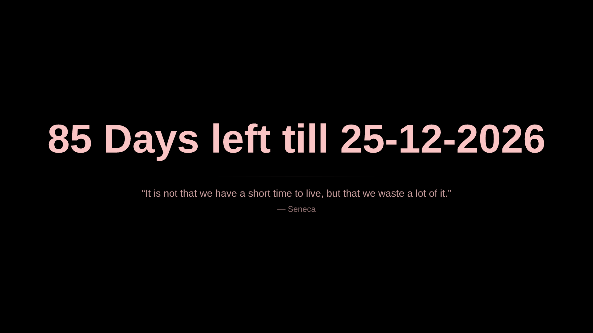
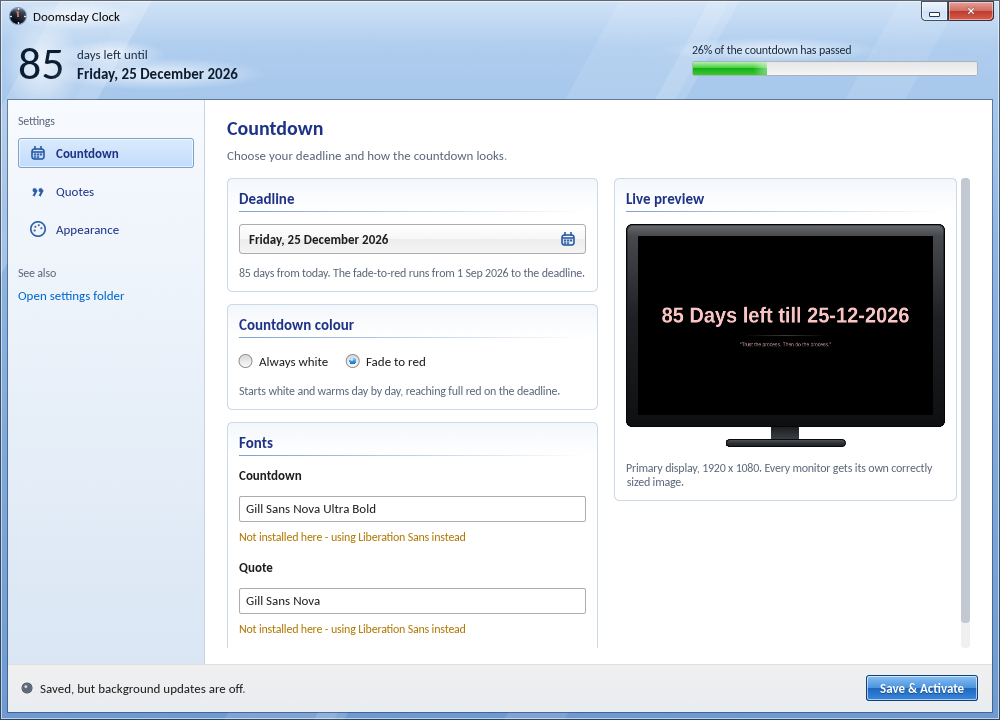
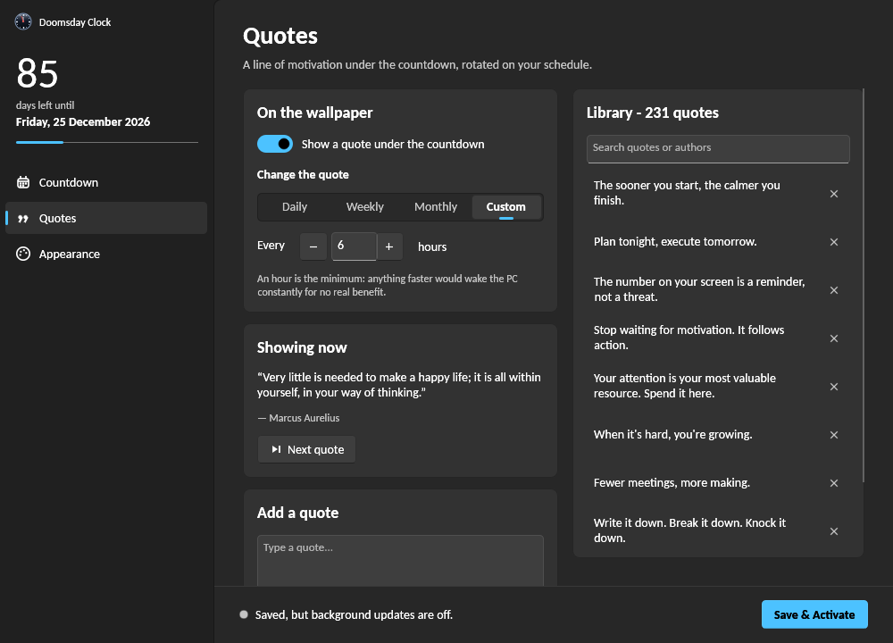
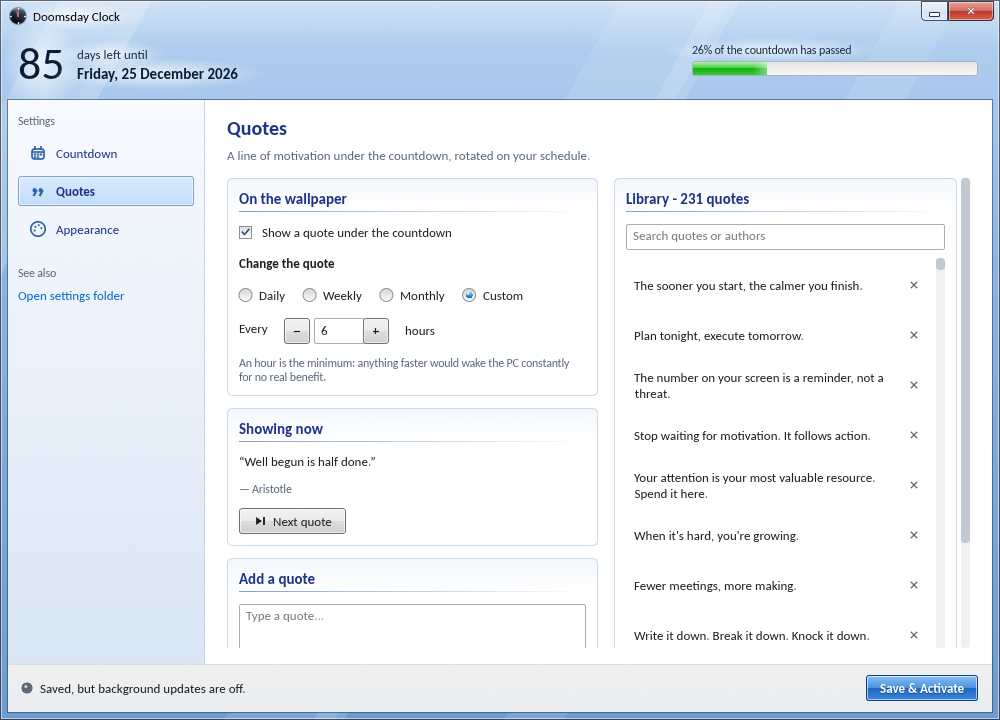
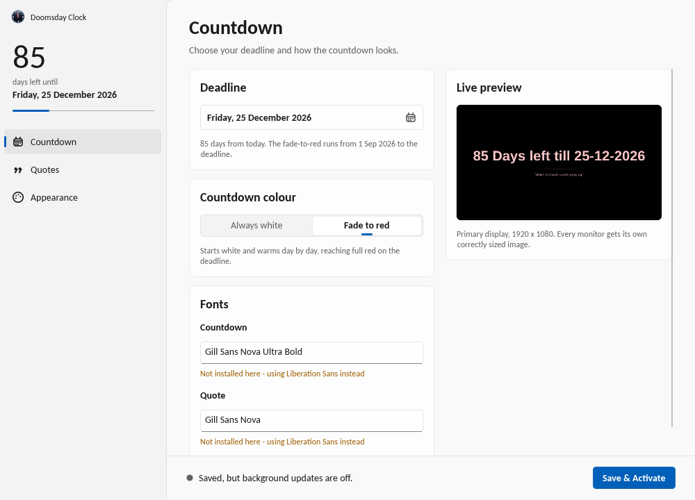
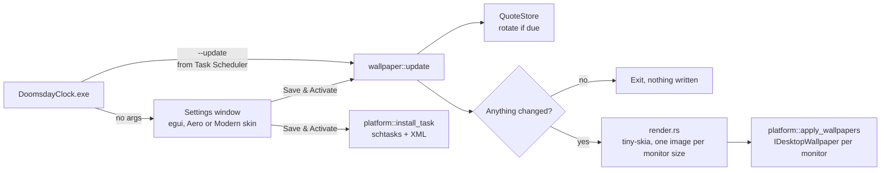

# Doomsday Clock

A Windows desktop countdown that lives on your wallpaper.

Pick a date. Every day your wallpaper becomes a black canvas reading
**“47 Days left till 25‑12‑2026”** in huge type, with a rotating quote
underneath. Optionally the text warms from white to red as the deadline
closes in.

The settings app comes in two complete skins you can switch between live:
**Aero** (a faithful Windows 7 revival: glass frame, glossy buttons, green
progress bar) and **Modern** (Windows 11: Mica, Fluent cards, light/dark).



| Aero (Windows 7) | Modern (Windows 11, dark) |
|---|---|
|  |  |
|  |  |

> Screenshots are taken from the development build, which uses stand-in
> fonts for Segoe UI. On Windows the app uses the real system fonts.

---

## Contents

- [Features](#features)
- [Install and use](#install-and-use)
- [How it works](#how-it-works)
- [Quotes: file format, importing, rotation](#quotes)
- [Performance](#performance)
- [Building from source](#building-from-source)
- [How to change common things](#how-to-change-common-things)
- [Design notes](#design-notes)
- [Troubleshooting](#troubleshooting)
- [Uninstalling](#uninstalling)

---

## Features

- **Daily countdown wallpaper.** Black background, centred text, sized to
  fill each monitor. The default font is *Gill Sans Nova Ultra Bold*, with
  graceful fallbacks if it isn't installed.
- **White or fade-to-red.** Text either stays white or shifts linearly from
  white (the day you set the countdown) to red (the deadline).
- **Rotating quotes.** 231 quotes ship with the app. Add your own in the app,
  import a JSON file, or edit `quotes.json` by hand.
  - New quotes always show first, newest first, then the whole library
    reshuffles.
  - Change the quote **daily, weekly, monthly, or every N hours** (minimum 1).
- **Every monitor done properly.** One image per monitor at its native
  resolution, so the text is centred on each screen and never split across a
  bezel.
- **Nothing running in the background.** A Windows Scheduled Task starts the
  app for a fraction of a second at 00:05, at sign-in, and (only for custom
  intervals) every N hours. Then it exits.
- **Two skins, switchable instantly.** Aero uses real Acrylic blur behind
  its glass frame on Windows 11 22H2+. Modern uses Mica. Both fall back to
  painted surfaces on older Windows.
- **One portable `.exe`, about 5 MB.** No installer, no runtime, no admin
  rights, no network access ever.

## Install and use

1. Download `DoomsdayClock.exe` from the [Releases](../../releases) page (or
   build it, see below). Put it somewhere permanent, for example
   `C:\Tools\DoomsdayClock\`. The scheduled task points at this location.
2. Run it. Pick your deadline, colour mode and quote schedule.
3. Click **Save & Activate**. Your wallpaper updates immediately and a
   per-user scheduled task keeps it current from then on.

Command-line modes (handy for scripts, and what the scheduled task uses):

| Command | What it does |
|---|---|
| `DoomsdayClock.exe` | Opens the settings window. |
| `DoomsdayClock.exe --update` | Silent refresh: rotate the quote if due, redraw only if something changed. |
| `DoomsdayClock.exe --next-quote` | Skip to the next quote and apply it now. |
| `DoomsdayClock.exe --render out.bmp 2560x1440` | Render a wallpaper to a file without applying it. |
| `DoomsdayClock.exe --uninstall` | Remove the scheduled task and all settings. |

## How it works



The headless path never creates a window or touches the GPU. It loads two
small JSON files, opens two font files, draws with the CPU and exits.

### Source map

| File | Responsibility |
|---|---|
| `src/main.rs` | Entry point. Routes command-line modes. |
| `src/config.rs` | Settings model, JSON load/save, quote rotation schedule (`Rotation::is_due`). |
| `src/countdown.rs` | Pure maths: headline text, fade colour, progress. |
| `src/quotes.rs` | Quote library, import/merge, dedupe, the newest-first/shuffle queue. |
| `src/fonts.rs` | Finds font files by family name, fallback chain, on-disk cache. |
| `src/render.rs` | Draws the wallpaper (tiny-skia + ttf-parser), word-wraps quotes, writes BMP. |
| `src/wallpaper.rs` | Orchestrates one update: rotate, skip-if-unchanged, render per monitor, apply. |
| `src/paths.rs` | Where files live; atomic writes. |
| `src/platform/windows.rs` | **All** Windows FFI: wallpaper COM, Task Scheduler, DWM Mica/Acrylic, file dialog. |
| `src/platform/fallback.rs` | Non-Windows stand-in so the app builds, runs and screenshots on Linux. |
| `src/ui/mod.rs` | The settings window: state, both skins' chrome, the three pages. |
| `src/ui/theme.rs` | Colour tables and type ramp for both skins. |
| `src/ui/widgets.rs` | Skinned controls: buttons, nav, cards, radios, toggles, spin box, progress bar, text fields. |
| `src/ui/paint.rs` | Gradient meshes, glows, vector icons, the logo. |
| `src/ui/calendar.rs` | Month-view date picker in both skins. |
| `src/ui/icon.rs` | Taskbar icon, rasterised at startup (no image assets in the repo). |
| `assets/quotes.json` | Starter quote library, compiled into the exe. |

### Where your data lives

| Path | Contents |
|---|---|
| `%APPDATA%\DoomsdayClock\config.json` | Settings. |
| `%APPDATA%\DoomsdayClock\quotes.json` | Your quote library (edit freely). |
| `%APPDATA%\DoomsdayClock\state.json` | Rotation state. Safe to delete; it just reshuffles. |
| `%LOCALAPPDATA%\DoomsdayClock\` | Rendered wallpapers and the font cache. Safe to delete. |

All JSON writes are atomic (write to a temp file, then rename), so a crash or
power cut can't leave a half-written settings file.

### The scheduled task

Registered per user under `Task Scheduler Library\DoomsdayClock\WallpaperUpdate`,
standard privileges, no UAC prompt:

- **Daily at 00:05**: the day count ticks over.
- **At sign-in**: catches up if the PC was off or asleep at midnight
  (`StartWhenAvailable` is also on).
- **Every N hours**: added only when the quote schedule is “Custom”.
- 2-minute execution limit, ignores new instances while one is running,
  runs on battery.

## Quotes

### `quotes.json` format

```json
{
  "quotes": [
    { "text": "Lost time is never found again.", "author": "Benjamin Franklin" },
    { "text": "The deadline doesn't move. You do." }
  ]
}
```

- `author` is optional. `id` and `added` are filled in automatically, so you
  can leave them out when adding quotes by hand.
- A bare array (`[ {"text": "..."}, ... ]`) is also accepted for imports.
- Quotes longer than 320 characters are rejected, since they won't fit
  legibly on a wallpaper.

### Import rules

- **Duplicates are skipped.** Matching ignores case, punctuation and spacing.
- **New quotes go to the front of the queue**, in the order they appear in
  the file.
- The import result tells you how many were added, skipped and rejected.

### Rotation algorithm

- `priority` holds newly added quotes, **newest first**. Anything in it goes
  up next.
- `deck` is a shuffled pass over the whole library (Fisher–Yates with a tiny
  built-in SplitMix64 generator, so no `rand` dependency).
- When both are empty, everything reshuffles. The quote currently on screen
  is kept off the top of the new deck, so the same quote never appears twice
  in a row.
- Quotes you add by editing `quotes.json` are detected on the next load and
  treated exactly like quotes added in the app.

### When a new quote is due

- **Daily / weekly / monthly** are calendar-based (a new day, 7+ days, a new
  month), so the quote flips with the countdown at midnight even if the task
  ran late.
- **Every N hours** is elapsed-time based with 10 minutes of slack, so a run
  that fires a few seconds early still counts. One hour is the minimum.

### About the bundled quotes

73 are short attributed quotes from public-domain-era sources (Seneca,
Marcus Aurelius, Franklin, Thoreau, Shakespeare, proverbs and so on). Commonly
misattributed quotes were deliberately left out. The other 158 are original
lines written for this project. Delete any you don't like from the Library
list.

## Performance

Measured in the Linux development container (release build, same rendering code as Windows):

| Operation | Time |
|---|---|
| Scheduled run when nothing changed | ~5 ms, no disk writes |
| Scheduled run that redraws a 1920×1080 wallpaper | ~21 ms |
| Settings window, idle | 0% CPU (reactive repaint only) |

Choices that keep it light:

- **Skip if unchanged.** Each run hashes everything that affects the image
  (dates, colour mode, fonts, quote, monitor sizes) and exits immediately if
  it matches the last render. An hourly task with a daily quote does almost
  nothing 23 times a day.
- **Font cache.** Scanning every installed font takes 100–300 ms on Windows.
  The scheduled run reads the resolved file path from a cache and opens only
  the two fonts it needs. The settings window scans on a background thread,
  so the window opens instantly.
- **One render per resolution.** Monitors that share a resolution share one
  image file.
- **One fill per text line.** All glyph outlines on a line go into a single
  path and are rasterised once.
- **Width-solved font size.** Text width is linear in font size, so the
  headline size is calculated directly instead of being searched for.
- **Alternating file names.** Windows sometimes ignores a wallpaper whose
  path didn't change; flipping between two names guarantees the refresh
  without writing a new file every day.
- **Release profile.** Fat LTO, one codegen unit, `panic = "abort"`,
  stripped symbols.

## Building from source

Requires Rust 1.95 or newer (the egui version used needs it) (`rustup` from <https://rustup.rs>).

```powershell
git clone <this repo>
cd DoomsdayClock
cargo build --release
# -> target\release\DoomsdayClock.exe
```

- `cargo test` runs the unit tests (rotation schedule, queue order, import
  dedupe, renderer centring and margins, BMP format, config migration).
- GitHub Actions builds, lints (clippy with warnings as errors) and tests on
  every push (`.github/workflows/build.yml`). Pushing a tag like `v2.0.0`
  publishes a Release with the exe attached (`release.yml`).
- The app also builds and runs on Linux for development. Wallpaper calls
  become log lines and the scheduled task becomes a marker file. Useful
  variables:
  - `DOOMSDAY_CLOCK_HOME=<dir>` keeps all files in a sandbox folder.
  - `DOOMSDAY_SCREEN=2560x1440` simulates a display size.
  - `DOOMSDAY_START_PAGE=quotes|appearance` opens on a page (debug builds).

### Dependencies, and why each one exists

| Crate | Why |
|---|---|
| `eframe` / `egui` (glow) | The settings window. Every pixel is custom-painted, which both skins require. OpenGL renderer, much lighter than wgpu for a small idle 2D window. Default features off: no bundled fonts, no accessibility tree, no Wayland. |
| `tiny-skia` | CPU rasteriser for the wallpaper. No GPU, no system dependencies. |
| `fontdb`, `ttf-parser` | Find a font file by family name; read glyph outlines and kerning. |
| `serde`, `serde_json` | Settings and quotes files. |
| `chrono` | Local date and time (the standard library has no time zone support). |
| `windows` | Microsoft's official Win32 bindings (Windows builds only). |
| `raw-window-handle` | Read the window handle from eframe for the DWM calls (Windows only). |

## How to change common things

| I want to… | Change |
|---|---|
| Use a different font | Type any installed family name, or a path to a `.ttf`/`.otf`, in **Countdown → Fonts**. Defaults live in `Config::default()` (`src/config.rs`); fallback chains in `Role::fallbacks()` (`src/fonts.rs`). |
| Change the wallpaper text | `countdown::headline()` in `src/countdown.rs`. |
| Change the fade colours | `WHITE` / `RED` in `src/countdown.rs`. |
| Change text sizes or layout on the wallpaper | Constants at the top of `render::render()` (headline 84% width cap, quote at 3% of height, max 5 lines). |
| Change when the task runs | `task_xml()` in `src/platform/windows.rs`. |
| Re-colour a skin | The `Colors` tables in `src/ui/theme.rs`. Widget gradients are in `src/ui/widgets.rs` (each Aero gradient sits next to its normal/hover/pressed states). |
| Add a setting | Add a field to `Config` (old files still load thanks to `#[serde(default)]`), add a control to a page in `src/ui/mod.rs`, and use it in `wallpaper.rs`. |
| Add a page | Add a variant to `Page` and its `ALL` table, then a `*_left` / `*_right` pair in `src/ui/mod.rs`. |

## Design notes

- **Aero is rebuilt, not emulated.** Windows 7's blur-behind API stopped
  producing blur after Windows 7. Windows 11 22H2 added a documented replacement
  (`DWMWA_SYSTEMBACKDROP_TYPE`). The Aero skin layers a translucent sky-blue
  tint, diagonal light streaks and a white top sheen over a live Acrylic
  backdrop, so the blur is real. Everything else is drawn with gradient
  meshes using colours sampled from Windows 7's controls: two-tone glossy
  push buttons with a hover bloom, Explorer-blue selection, the Control
  Panel task pane, a glossy monitor bezel around the preview, and the green
  progress bar, which turns yellow at 75% and red at 90% just like Windows 7's
  paused and error states.
- **Modern follows WinUI 3.** Mica backdrop, a content layer with a rounded
  corner, Fluent cards, accent pill navigation, toggle switches, segmented
  choices and your system accent colour. Light, dark, or follow Windows.
- **Same pages, different chrome.** Pages call skinned widgets and never
  check which skin is active, so new features automatically appear in both
  looks.
- **Glass is opt-in by capability.** The backdrop is enabled only on Windows
  builds that really implement it (22621+). Elsewhere both skins paint
  opaque versions of the same design.

## Troubleshooting

- **“Not installed here — using … instead” under Fonts.** Gill Sans Nova is a
  commercial font. If you have Microsoft 365, open Word, pick “Gill Sans Nova
  Ultra Bold” once so Office downloads it (Office fetches cloud fonts on
  first use), then reopen Doomsday Clock. The app
  also looks in Office's cloud-font folder, which Windows doesn't. Or install
  any `.ttf`/`.otf` and type its path.
- **Windows SmartScreen warns about the exe.** The exe isn't code-signed.
  Choose *More info → Run anyway*, or build it yourself.
- **The wallpaper stopped updating after I moved the exe.** The task points
  at the old location. Open the app from the new location and click
  **Save & Activate** again.
- **Check that the task ran.** Task Scheduler → `DoomsdayClock` →
  *Last Run Result* should be `0x0`.

## Uninstalling

- **Stop updates but keep settings:** Appearance → Background updates →
  **Turn off**.
- **Remove everything:** run `DoomsdayClock.exe --uninstall` (removes the
  scheduled task and all settings, quotes and cached images), then delete the
  exe.

Your current wallpaper stays until you change it.

## License

MIT. See [LICENSE](LICENSE).
